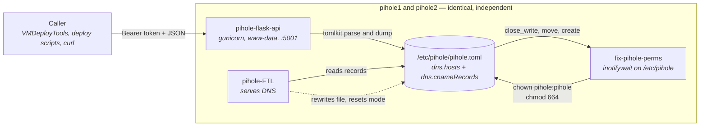

# pihole-flask-api

> REST API for adding and removing A and CNAME records in Pi-hole v6's `pihole.toml`.

[](https://github.com/vollminlab/pihole-flask-api/actions/workflows/ci.yml)


A small Flask app behind Gunicorn, running on the Pi-hole hosts themselves, that edits
`/etc/pihole/pihole.toml` directly so scripts and provisioning tooling can register DNS records
without SSH. The non-obvious part is what keeps it working: Pi-hole rewrites `pihole.toml` on its
own schedule and resets the file's ownership and mode when it does, which would leave the API — it
runs as `www-data` — unable to write. A companion `fix-pihole-perms` service watches `/etc/pihole`
with `inotifywait` and restores access within milliseconds of every rewrite. Without that watcher
the API silently degrades to returning `500` on every write while DNS keeps resolving normally.

---

## Architecture



The API is a plain file editor. It does **not** call Pi-hole, does not signal or restart
`pihole-FTL`, and holds no state of its own — `pihole.toml` is the only source of truth.

### Record formats

Pi-hole v6 stores both record types as arrays of strings under `[dns]`:

| Type | TOML key | Entry format | Example |
|------|----------|--------------|---------|
| A | `dns.hosts` | `"<ip> <hostname>"` — space separated | `"192.168.152.244 homepage.vollminlab.com"` |
| CNAME | `dns.cnameRecords` | `"<alias>,<target>"` — comma separated | `"go.vollminlab.com,shlink.vollminlab.com"` |

Files are read and written with `tomlkit`, which preserves comments and formatting in the rest of
`pihole.toml` rather than rewriting the whole document.

### Why `fix-pihole-perms` exists

Pi-hole rewrites `pihole.toml` whenever FTL restarts, updates, or reloads its config, and the file
comes back as `pihole:pihole` mode `644`. The API runs as `www-data`, so after any such rewrite the
next write attempt raises `PermissionError`, which the route handlers convert to
`500 {"error": "Failed to write TOML: ..."}`. Nothing else breaks — DNS keeps resolving — so the
failure is easy to misdiagnose as an API bug.

`scripts/fix-pihole-perms.sh` is a three-line loop that closes that window:

```bash
while inotifywait -e close_write,move,create /etc/pihole; do
    chown pihole:pihole /etc/pihole/pihole.toml
    chmod 664 /etc/pihole/pihole.toml
done
```

Two details worth knowing before changing it:

- It watches the **directory**, not the file, and includes `move` and `create` alongside
  `close_write`. A watch on the file's inode would be lost the moment Pi-hole replaces the file
  instead of editing it in place.
- `chown`/`chmod` emit `ATTRIB`, which is not in the watched event set, so the watcher cannot
  retrigger itself. The API's own writes do fire `close_write` — that is harmless and intentional.

The script only restores `pihole:pihole 664`. Group write is what gives `www-data` access, so
`www-data` must be a member of the `pihole` group on the host — **`scripts/deploy.sh` does not do
this for you.** Grant it once per host, or use the ACL alternative under
[Troubleshooting](#troubleshooting).

---

## Endpoints

All four endpoints require `Authorization: Bearer <PIHOLE_API_KEY>` and a JSON request body.
Successful responses are `{"message": "..."}`; failures are `{"error": "..."}`.

| Method | Path | Body | Success |
|--------|------|------|---------|
| `POST` | `/add-a-record` | `{"domain": "...", "ip": "..."}` | `200` |
| `DELETE` | `/delete-a-record` | `{"domain": "..."}` | `200` |
| `POST` | `/add-cname-record` | `{"domain": "...", "target": "..."}` | `200` |
| `DELETE` | `/delete-cname-record` | `{"domain": "..."}` | `200` |

| Status | Meaning |
|--------|---------|
| `200` | Record added, deleted, or already present |
| `400` | A required body field is missing or empty |
| `401` | `Authorization` header missing, not `Bearer `-prefixed, or token mismatch |
| `404` | `DELETE` only — no entry matched the domain |
| `500` | Reading or writing `pihole.toml` failed — almost always permissions |

There is no `/` route and no health endpoint. A `404` from `GET /` means the service is up.

### POST /add-a-record

Appends `"<ip> <domain>"` to `dns.hosts`.

```bash
curl -X POST http://<host>:5001/add-a-record \
  -H 'Content-Type: application/json' \
  -H 'Authorization: Bearer <API_KEY>' \
  -d '{"domain": "myhost.vollminlab.com", "ip": "192.168.1.100"}'
```

```json
{"message": "Record added successfully"}
```

Idempotent on the **exact** string `"<ip> <domain>"`. Re-posting the same pair returns
`200 {"message": "Record already exists"}` and writes nothing. Posting the *same domain with a
different IP* is not deduplicated — it appends a second entry, leaving two A records for that name.

### DELETE /delete-a-record

Removes every entry in `dns.hosts` whose hostname field equals `domain`, regardless of IP.

```bash
curl -X DELETE http://<host>:5001/delete-a-record \
  -H 'Content-Type: application/json' \
  -H 'Authorization: Bearer <API_KEY>' \
  -d '{"domain": "myhost.vollminlab.com"}'
```

```json
{"message": "Deleted 1 record(s) for myhost.vollminlab.com"}
```

Returns `404 {"error": "Record not found"}` when nothing matched.

### POST /add-cname-record

Appends `"<domain>,<target>"` to `dns.cnameRecords`.

```bash
curl -X POST http://<host>:5001/add-cname-record \
  -H 'Content-Type: application/json' \
  -H 'Authorization: Bearer <API_KEY>' \
  -d '{"domain": "go.vollminlab.com", "target": "shlink.vollminlab.com"}'
```

```json
{"message": "Record added successfully"}
```

Deduplication here checks the **alias only, not the target**. If `alias → target1` already exists,
posting `alias → target2` returns `200 {"message": "Record already exists"}` and changes nothing.
To repoint a CNAME, delete it first, then add it.

### DELETE /delete-cname-record

Removes every `dns.cnameRecords` entry whose alias equals `domain`.

```bash
curl -X DELETE http://<host>:5001/delete-cname-record \
  -H 'Content-Type: application/json' \
  -H 'Authorization: Bearer <API_KEY>' \
  -d '{"domain": "go.vollminlab.com"}'
```

```json
{"message": "Deleted 1 record(s) for go.vollminlab.com"}
```

---

## Authentication

A single shared bearer token, compared by exact string equality — no JWT, no expiry, no per-caller
identity. `_authorize()` requires the header to literally start with `Bearer ` and the remainder to
equal `PIHOLE_API_KEY`; anything else logs `Unauthorized access attempt.` and returns `401`.

The token lives in `/etc/pihole-flask-api/.env` on each host (`root:www-data`, mode `640`) and is
loaded two ways: systemd's `EnvironmentFile=`, and again by `src/recordimporter.py` at import time
so the app runs identically under `pytest` or a bare `flask run`. If `PIHOLE_API_KEY` is unset the
module raises `RuntimeError("Missing PIHOLE_API_KEY in environment")` and Gunicorn will not start.

In this homelab the token is stored in 1Password (`Homelab` vault) and read with the `op` CLI —
never committed, never passed on a command line that lands in shell history.

---

## Configuration

### Environment

| Name | Where | Default | Notes |
|------|-------|---------|-------|
| `PIHOLE_API_KEY` | `/etc/pihole-flask-api/.env` | none — **required** | Bearer token; missing value aborts startup |

The in-process `.env` parser (`_load_env_file`) handles the shapes a hand-edited file actually
takes: blank lines, `#` comments, and lines with no `=` are skipped, and one *matched* pair of
surrounding quotes is stripped so `KEY="v"` and `KEY='v'` both yield `v` while a value that merely
contains a quote is left intact.

It is still not a shell: there is no interpolation, no multi-line values, and no `export` prefix
handling. Write the file as `.env.example` shows — one `KEY=value` per line.

> Until [#6](https://github.com/vollminlab/pihole-flask-api/pull/6), a single blank line produced
> `os.environ[""] = ""`, which raises `OSError: [Errno 22]` at import and took the service down with
> a traceback naming neither the file nor the line. If you hit that on an older deployment, that is
> the cause.

### Module constants

Set in `src/recordimporter.py`; not configurable at runtime.

| Constant | Value |
|----------|-------|
| `env_path` | `/etc/pihole-flask-api/.env` |
| `TOML_PATH` | `/etc/pihole/pihole.toml` |
| `LOG_FILE` | `/opt/pihole-api.log` |

Logging is `INFO` to both `LOG_FILE` and stdout, so every request also lands in
`journalctl -u pihole-flask-api`. Per-request detail is logged at `DEBUG` and is therefore silent
at the configured level; only auth failures, missing fields and TOML errors appear by default.

### systemd

Both unit templates live in `services/` and are rendered by `scripts/deploy.sh`.

| Unit | Setting | Value |
|------|---------|-------|
| `pihole-flask-api` | `ExecStart` | `gunicorn --workers 2 --bind 0.0.0.0:5001 --chdir <APP>/src recordimporter:app` |
| | `User` / `Group` | `www-data` / `www-data` |
| | `EnvironmentFile` | `/etc/pihole-flask-api/.env` |
| | `Wants` | `pihole-FTL.service` |
| | `Restart` | `always` |
| `fix-pihole-perms` | `ExecStart` | `/usr/local/bin/fix-pihole-perms.sh` |
| | `Type` | `simple` |
| | `Restart` | `always` |

`{{VENV}}` and `{{APP}}` in `services/pihole-flask-api.service.tpl` are substituted at deploy time;
`services/fix-pihole-perms.service.tpl` is copied verbatim.

### Deploy script variables

Edit at the top of `scripts/deploy.sh`.

| Variable | Default |
|----------|---------|
| `APP_DIR` | `/opt/pihole-flask-api` |
| `VENV_DIR` | `/opt/pihole-flask-api-venv` |
| `ENV_DIR` | `/etc/pihole-flask-api` |
| `REPO_URL` | `https://github.com/vollminlab/pihole-flask-api.git` — change if deploying a fork |

---

## Deployment

### Requirements

- Debian-based host — Raspberry Pi OS, Ubuntu, etc.
- Pi-hole v6+ (this reads `pihole.toml`; v5's `dnsmasq.d` layout is not supported)
- SSH access with `sudo` to the target host
- `python3-venv` and `inotify-tools`, installed by the deploy script via `apt-get`
- A bash shell locally to run the deploy script — Git Bash works, `MSYS_NO_PATHCONV=1` is exported
  so it does not mangle the remote paths

### Topology

The two Pi-hole hosts run this API independently. There is **no replication of API writes between
them** — nebula-sync syncs on its own schedule and its timing is not something a caller can rely on.

| Host | API address | Role |
|------|-------------|------|
| pihole1 | `http://192.168.100.2:5001` | keepalived VRRP MASTER |
| pihole2 | `http://192.168.100.3:5001` | keepalived VRRP BACKUP |
| VRRP VIP | `192.168.100.4` | DNS service address; whichever host currently holds it answers |

Calling the VIP reaches exactly one host and leaves the other stale. **Issue every record change
against both host IPs directly**, then confirm parity in each host's `pihole.toml`.

### Installing

```bash
# once per host — the script prompts for PIHOLE_API_KEY and is safe to re-run
bash scripts/deploy.sh pihole1
bash scripts/deploy.sh pihole2
```

The script installs system packages, clones or fast-forwards the repo, rebuilds the virtualenv with
`--clear`, creates the log file, writes the env file `640 root:www-data`, installs the watcher
script and both units, then enables and restarts both services. If `/opt/pihole-flask-api` exists
but is not a git checkout it is moved aside to `/opt/pihole-flask-api.bak` rather than overwritten.

For a code-only update, skip the script:

```bash
ssh pihole1 "sudo git -C /opt/pihole-flask-api pull && sudo systemctl restart pihole-flask-api"
ssh pihole2 "sudo git -C /opt/pihole-flask-api pull && sudo systemctl restart pihole-flask-api"
```

Do one host at a time so DNS management stays available.

### What lands on the host

| Path | Contents |
|------|----------|
| `/opt/pihole-flask-api/` | Application code — git clone |
| `/opt/pihole-flask-api-venv/` | Python virtualenv |
| `/etc/pihole-flask-api/.env` | API key — `root:www-data`, mode `640` |
| `/opt/pihole-api.log` | Application log — `www-data:www-data` |
| `/usr/local/bin/fix-pihole-perms.sh` | Permissions watcher |
| `/etc/systemd/system/pihole-flask-api.service` | API unit |
| `/etc/systemd/system/fix-pihole-perms.service` | Watcher unit |

---

## Callers

`VMDeployTools` is the main automated consumer: during VM provisioning it POSTs to `add-a-record`
to register `<VMName>.vollminlab.com → <IPAddress>`, with the target host and port set by
`PiHoleServer` and `PiHolePort` in its config. Ad-hoc bulk record work is done by
`homelab-infrastructure/scripts/deploy-pihole-flask-api.sh --dns`, which loops over both host IPs.

`external-dns` in the Kubernetes cluster does **not** use this API. It talks to Pi-hole's own v6 API
on port 80 (`--pihole-server=http://192.168.100.2 --pihole-api-version=6`). The two write to the
same records by different routes, which is worth remembering when a record appears or disappears
without a corresponding entry in `/opt/pihole-api.log`.

---

## Development

```bash
python3 -m venv .venv && .venv/bin/pip install -r requirements.txt -r requirements-dev.txt
.venv/bin/pytest
```

`pytest.ini` puts `src` on `pythonpath`. `tests/conftest.py` sets a dummy `PIHOLE_API_KEY` and
patches `logging.FileHandler` before importing the app, because the module opens `/opt/pihole-api.log`
at import time and that path does not exist on a dev machine. Each test redirects `TOML_PATH` at a
`tmp_path` fixture, so the suite never touches a real `pihole.toml`.

Coverage spans auth rejection, happy paths, idempotency, missing-field `400`s, delete `404`s, and
`500`s injected by patching `_load_toml`/`_save_toml`.

CI (`.github/workflows/ci.yml`) runs the suite on **Python 3.11 and 3.12** on push and PR to `main`,
on the org's self-hosted `vollminlab` runners. Both matrix legs — `test (3.11)` and `test (3.12)` —
are required status checks, so a change that breaks either Python version cannot merge.

Runtime pins: `Flask 3.1.3`, `tomlkit 0.14.0`, `gunicorn 22.0.0`. `inotify-tools` is a system
package, not a Python dependency.

---

## Troubleshooting

**Every write returns `500`, reads are fine**
The `pihole.toml` permissions have been reset. Check the watcher first:

```bash
systemctl status fix-pihole-perms
ls -la /etc/pihole/pihole.toml     # want: -rw-rw-r-- pihole pihole
```

Restore by hand if needed — group membership is the durable fix, the ACL is the fallback:

```bash
sudo chown pihole:pihole /etc/pihole/pihole.toml
sudo chmod 664 /etc/pihole/pihole.toml
sudo usermod -aG pihole www-data && sudo systemctl restart pihole-flask-api
# or, without touching group membership:
sudo setfacl -m u:www-data:rw /etc/pihole/pihole.toml
```

**`500` from `/delete-a-record` with correct permissions**
An entry in `dns.hosts` with no space in it — a bare hostname, no IP — makes the delete filter index
past the end of the split and raise, outside the handler's `try`. Fix the malformed entry in
`pihole.toml`.

**Service will not start**

```bash
sudo journalctl -u pihole-flask-api --no-pager -n 30
```

`RuntimeError: Missing PIHOLE_API_KEY` means the env file is absent, unreadable by `www-data`, or
has no `PIHOLE_API_KEY=` line.

**`401` on every request**
Confirm the header is `Authorization: Bearer <key>` — the space after `Bearer` is required — and
that the key matches `/etc/pihole-flask-api/.env` **on the host you actually called**. The two hosts
can hold different keys after a partial rotation.

**A record exists on one Pi-hole only**
Expected after a call to the VIP or to a single host. Replay the request against the other host and
diff both `pihole.toml` files.

---

## License

MIT — see [LICENSE](LICENSE).
